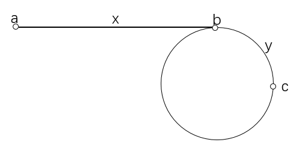

证明：如上图所示，a是起点，b是环的入口，c是俩个指针相遇点，ab之间距离为 x , bc 之间距离是 y。

当 slow 走到 b 时，由于 fast 比 slow 走的快(两倍)，所以 fast 已经从 b 开始在环上走了 x 步，可能是多余一圈，距离 b 还差 y 步
> 我们知道俩个指针相遇的点在 c ,我们让 slow 退回到 b,fast 则会退回 2y 步，所以就是距离 b 还差 y 步,可以画图模拟一下

知道了 fast 距离 b 还差 y 步，上面知道了 fast 从 b 开始在环上走了 x 步。所以环的长度为 x+y 的 n 倍。
所以当俩个指针相遇时，把 fast 放回原点，slow 在 c 点不动。然后每次都走一步，下一次相遇的时候就是 b 点环的入口。
> 假设 x+y 为环的长度为的 1 倍，而且 bc 之间 短的那段为 y 则另一段长的就是 x 。ab 距离刚好也是 x,
> 所以从 c 点往 b 走 和从 a 往 b 走最终肯定会在 b 点相遇
> 
>如果是两倍的话也同理 bc 短为 y ，bc 长则为0.5x+0.5y-y=0.5x-0.5y 就不会再第一圈相遇了
> 第二圈的时候 c 点开始的指针走到 b 点的距离是 0.5x-0.5y+0.5x+0.5y=x
> 从 a 点开始的指针走的距离也是 x 也能相遇 

算法流程：
1）双指针第一次相遇： 设两指针 fast，slow 指向链表头部 head，fast 每轮走 22 步，slow 每轮走 11 步；

1.1）第一种结果： fast 指针走过链表末端，说明链表无环，直接返回 null；

TIPS: 若有环，两指针一定会相遇。因为每走 11 轮，fast 与 slow 的间距 +1+1，fast 终会追上 slow；
1.2）第二种结果： 当fast == slow时， 两指针在环中 第一次相遇 。下面分析此时fast 与 slow走过的 步数关系 ：

设链表共有 a+ba+b 个节点，其中 链表头部到链表入口 有 aa 个节点（不计链表入口节点）， 链表环 有 bb 个节点（这里需要注意，aa 和 bb 是未知数，例如图解上链表 a=4a=4 , b=5b=5）；设两指针分别走了 ff，ss 步，则有：
fast 走的步数是slow步数的 22 倍，即 f = 2sf=2s；（解析： fast 每轮走 22 步）
fast 比 slow多走了 nn 个环的长度，即 f = s + nbf=s+nb；（ 解析： 双指针都走过 aa 步，然后在环内绕圈直到重合，重合时 fast 比 slow 多走 环的长度整数倍 ）；
以上两式相减得：f = 2nbf=2nb，s = nbs=nb，即fast和slow 指针分别走了 2n2n，nn 个 环的周长 （注意： nn 是未知数，不同链表的情况不同）。
2）目前情况分析：

如果让指针从链表头部一直向前走并统计步数k，那么所有 走到链表入口节点时的步数 是：k=a+nb（先走 aa 步到入口节点，之后每绕 11 圈环（ bb 步）都会再次到入口节点）。
而目前，slow 指针走过的步数为 nbnb 步。因此，我们只要想办法让 slow 再走 aa 步停下来，就可以到环的入口。
但是我们不知道 aa 的值，该怎么办？依然是使用双指针法。我们构建一个指针，此指针需要有以下性质：此指针和slow 一起向前走 a 步后，两者在入口节点重合。那么从哪里走到入口节点需要 aa 步？答案是链表头部head。
3）双指针第二次相遇：

slow指针 位置不变 ，将fast指针重新 指向链表头部节点 ；slow和fast同时每轮向前走 11 步；
TIPS：此时 f = 0f=0，s = nbs=nb ；
当 fast 指针走到f = af=a 步时，slow 指针走到步s = a+nbs=a+nb，此时 两指针重合，并同时指向链表环入口 。
4）返回slow指针指向的节点。

https://leetcode-cn.com/problems/linked-list-cycle-ii/solution/linked-list-cycle-ii-kuai-man-zhi-zhen-shuang-zhi-/